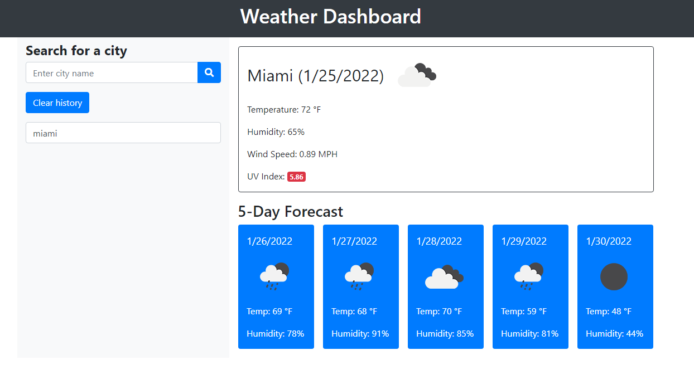

# Server-Side APIs Challenge: Weather Dashboard Created by Jeancarlos Mulet w/  🙌 The University of Miami 🙌

**Version 1.0.0** 

## Description 
For this challenge I was instructed to build a weather dashboard that will run in the browser and feature dynamically updated HTML and CSS.

## Acceptance Criteria

- GIVEN a weather dashboard with form inputs

- WHEN I search for a city
- THEN I am presented with current and future conditions for that city and that city is added to the search history
- WHEN I view current weather conditions for that city
- THEN I am presented with the city name, the date, an icon representation of weather conditions, the temperature, the humidity, the wind speed, and the UV index
- WHEN I view the UV index
- THEN I am presented with a color that indicates whether the conditions are favorable, moderate, or severe
- WHEN I view future weather conditions for that city
- THEN I am presented with a 5-day forecast that displays the date, an icon representation of weather conditions, the temperature, the wind speed, and the humidity
- WHEN I click on a city in the search history
- THEN I am again presented with current and future conditions for that city

## Usage 
 [LINK TO GITHUB HOSTED WEBSITE]()   
Test/School/Homework Purposes Only

## Credits

For this Challange I referenced my code in a similar project [""](), Youtube, Google, 
Instructions from my Class TA's
- Jordan 
- Jocelyn
- Tim
- Cristian

and directions from my Instructor 
- Felicia O'Garra

## Badges

© January 2022  Jeancarlos Mulet
